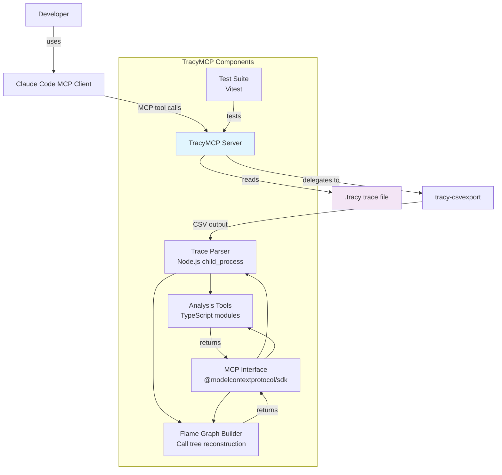
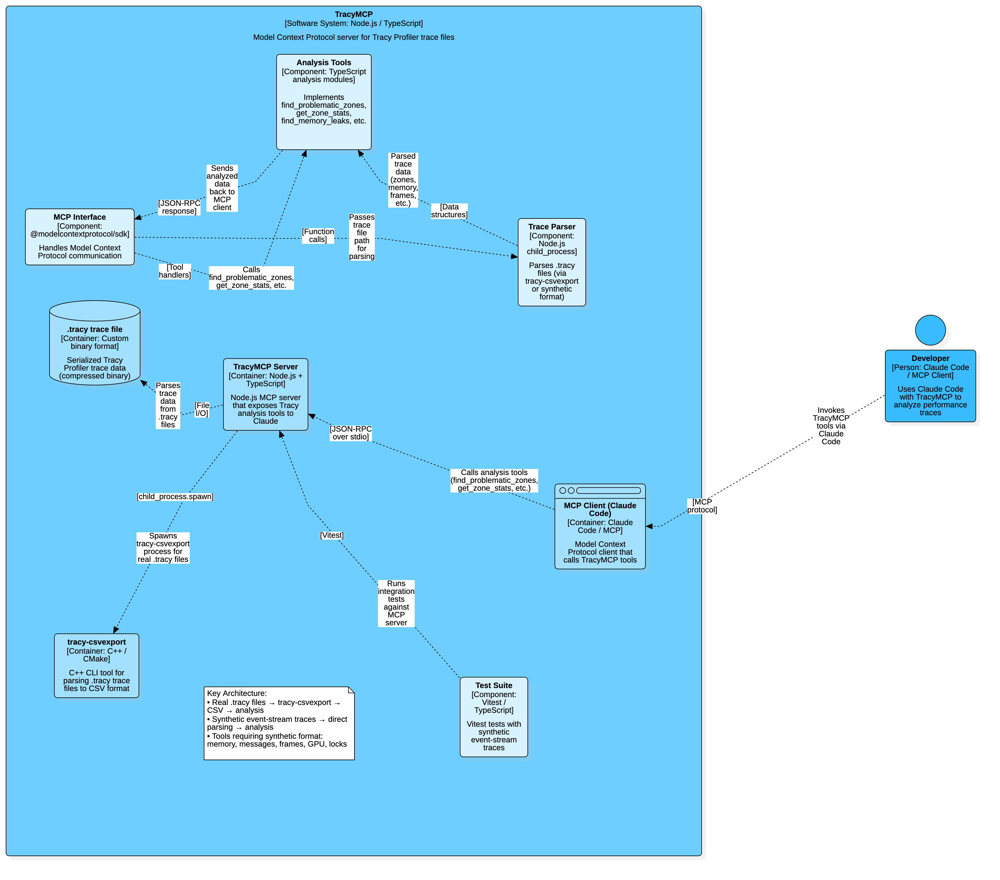

# Tracy MCP Server

Model Context Protocol server for [Tracy Profiler](https://github.com/wolfpld/tracy) `.tracy` trace files.
Lets Claude read real performance traces and help you find and fix problems.

## Setup

### 1. Build dependencies

```bash
# tracy-csvexport — needed to parse real .tracy save files
cd /path/to/tracy/csvexport
cmake -S . -B build -DCMAKE_BUILD_TYPE=Release
cmake --build build -j$(nproc)

# tracy-capture — needed to record traces from running apps
cd /path/to/tracy/capture
cmake -S . -B build -DCMAKE_BUILD_TYPE=Release
cmake --build build -j$(nproc)
```

### 2. Install and build the MCP server

```bash
cd /path/to/tracy/tracymcp
npm install
npm run build
```

### 3. Register with Claude Code

Add to `~/.claude.json` (global) or `.claude/settings.json` (project):

```json
{
  "mcpServers": {
    "tracy": {
      "command": "node",
      "args": ["/path/to/tracy/tracymcp/dist/index.js"]
    }
  }
}
```

Restart Claude Code. The tools are available immediately.

---

## Recording a Trace

Instrument your app with Tracy macros, then capture while it runs:

```bash
# Terminal 1 — start capture (waits for app, saves on disconnect)
tracy-capture -o my_trace.tracy -f

# Terminal 2 — run your app
./my_app
```

When your app exits, `my_trace.tracy` is saved automatically. Pass that path to any tool below.

### Quick demo

```bash
cd tracymcp/demo
make          # build demo C program
make run      # run it (requires tracy-capture running in another terminal)
```

---

## Debugging with Claude

The intended workflow is: record a trace, hand the path to Claude, describe the symptom.
Claude picks the right tool(s), interprets the numbers, and tells you what to fix.

### "My app is slow — what's taking the most time?"

```
find_problematic_zones(path="/traces/my_trace.tracy")
```

You get a ranked list of slow zones with severity, timings, and a suggested fix.
Thread names are shown when available:

```
Found 3 problematic zone(s):

🔴 #1: database_query  [main thread]
   Location: main.cpp:86
   Issues:
   • High total time: 66.28 ms
   • High average time: 66.28 ms
   Stats: 1 call, avg: 66.28ms, min: 66.28ms, max: 66.28ms, total: 66.28ms
   💡 Consider caching results or moving to background thread

🟡 #2: render  [render thread]
   Location: renderer.cpp:210
   Issues:
   • High P90: 12.40ms (P50: 1.54ms, P99: 18.35ms)
   Stats: 847 calls, avg: 2.10ms, min: 0.81ms, max: 18.35ms, total: 1779.37ms
   💡 Investigate occasional spikes — may be GC or lock contention

🟢 #3: physics_update  [worker]
   Location: physics.cpp:44
   Issues:
   • Inconsistent timing (CV: 94.0%)
   Stats: 847 calls, avg: 1.20ms, min: 0.10ms, max: 9.70ms, total: 1016.40ms
   💡 Check for variable-sized work batches or lock contention
```

Tighten the thresholds if your app has a strict frame budget:

```
find_problematic_zones(
  path="/traces/my_trace.tracy",
  max_total_time_ms=16,    # flag anything over 16 ms total
  max_avg_time_ms=2        # flag anything averaging over 2 ms
)
```

---

### "I need full stats for one specific function"

```
get_zone_stats(path="/traces/my_trace.tracy", zone="render")
```

```
Zone: render
Thread: render thread
Location: renderer.cpp:210

Statistics
----------
Calls: 847
Total Time: 1779.370 ms
Average Time: 2.101 ms
Min Time: 0.812 ms
Max Time: 18.347 ms
Std Dev: 1.834 ms
Coefficient of Variation: 87.3%
P50: 1.540 ms
P90: 4.210 ms
P99: 12.860 ms
```

A high P99 with a low average means rare but severe spikes — worth investigating separately.
If the same zone name appears at multiple source locations (e.g. `render` defined in five files),
all of them are shown with their `[1/5]` prefix.

---

### "What zones exist in this trace?"

```
list_zones(path="/traces/my_trace.tracy")
list_zones(path="/traces/my_trace.tracy", filter="render")  # narrow down
```

Use this to explore unfamiliar traces or find the exact name to pass to `get_zone_stats`.

---

### "I suspect a memory leak — where is it?"

```
get_memory_stats(path="/traces/my_trace.tracy")
```

```
Memory Statistics
==================
Total Allocated: 180.99 MB
Total Freed: 151.59 MB
Current Usage: 29.40 MB
Peak Usage: 93.40 MB
Allocations: 624
Frees: 261
Potential Leaks: 363
```

If `Current Usage` is much higher than expected, or `Potential Leaks` is nonzero, dig in:

```
find_memory_leaks(path="/traces/my_trace.tracy")
```

```
Found 5 memory issue(s):

🔴 #1: LEAK
   Memory leak: 16384.0 KB at 0x10003000 (TextureCache/terrain_normal.dds)
   💡 Ensure proper deallocation or use smart pointers/RAII

🔴 #2: LEAK
   Memory leak: 4096.0 KB at 0x10002000 (TextureCache/terrain_diffuse.dds)
   💡 Ensure proper deallocation or use smart pointers/RAII

🟡 #3: SPIKE
   Memory spike: peak was 93.4 MB, now 29.4 MB
   💡 Investigate temporary allocations — consider reusing memory or object pooling
```

By default only leaks > 1 MB are shown. Lower the threshold to catch smaller ones:

```
find_memory_leaks(
  path="/traces/my_trace.tracy",
  max_leak_size_mb=0.064    # show everything above 64 KB
)
```

---

### "What did my app log during the trace?"

```
list_messages(path="/traces/my_trace.tracy")
list_messages(path="/traces/my_trace.tracy", severity="Warning")
list_messages(path="/traces/my_trace.tracy", filter="timeout")
```

```
5 message(s):

[   0.000ms] ℹ️  INFO     Engine initialised
[  16.000ms] ℹ️  INFO     Frame 1 complete
[  32.500ms] ⚠️  WARNING  Frame took 50ms — over budget
[  82.000ms] ❌ ERROR    Shader compile failed: syntax error at line 42
[  82.100ms] ℹ️  INFO     Fallback shader loaded
```

Useful for correlating log events with timing spikes from `find_problematic_zones`.

---

### "Is my frame rate stable?"

```
get_frame_stats(path="/traces/my_trace.tracy")
```

```
Frame Stats
===========

[Game Frame] 3 frames
  Avg FPS:      41.7
  Avg frame:    24.0 ms
  P50:          16.0 ms
  P99:          50.0 ms
  Min:          16.0 ms
  Max:          50.0 ms
  Dropped (>16.7ms): 1 / 3 (33.3%)
```

`Dropped` counts frames that exceeded 60 Hz budget. A high P99 with a low average points to
occasional hitches rather than a sustained throughput problem.

---

### "What are my custom metrics doing?"

```
get_plot_stats(path="/traces/my_trace.tracy")
```

```
Plot Stats
==========

FPS
  Min:      41.7
  Max:     120.0
  Avg:      85.3
  Last:     60.0
  Duration: 1000.0 ms
```

Use `TracyPlot("FPS", fps)` in your app to push any numeric metric into the trace.
Good candidates: draw calls, entity count, cache hit rate, queue depth.

---

### "Where are threads blocking on locks?"

```
find_lock_contention(path="/traces/my_trace.tracy")
find_lock_contention(path="/traces/my_trace.tracy", min_wait_ms=5)
```

```
Lock Contention Report
======================

RenderMutex (lock 0x1001)
  Total wait:   7.0 ms
  Max single wait: 7.0 ms
  Contention count: 1
  💡 Consider lock-free data structures or finer-grained locking
```

High `contention count` with low `max single wait` suggests frequent but short blocking —
a candidate for a reader-writer lock or lock-free queue.
High `max single wait` with low count means rare but severe stalls — look for long critical sections.

---

### "Is the GPU keeping up?"

```
find_problematic_gpu_zones(path="/traces/my_trace.tracy")
find_problematic_gpu_zones(path="/traces/my_trace.tracy", max_avg_time_ms=2, max_total_time_ms=16)
```

```
Problematic GPU Zones
=====================

🔴 DrawScene  (context 0)
   Total: 8.0 ms, Avg: 8.0 ms, Calls: 1
   💡 Optimize shaders or reduce draw call count
```

GPU zones are recorded with `TracyGpuZone` / `TracyGpuZoneC`. They show actual GPU time,
not CPU submission time.

---

### "Show me the flame graph"

```
get_flame_graph(path="/traces/my_trace.tracy")
get_flame_graph(path="/traces/my_trace.tracy", format="folded", max_depth=12)
```

```
Flame Graph  (total captured: 635.83ms)

├── frame [AppDelegate.swift:62]
│       426.63ms (67.1%)  ×597  self=42.77ms (6.7%)
│   ├── image_edge_detect [ImageScene.swift:97]
│   │       150.87ms (23.7%)  ×60
│   ├── image_box_blur [ImageScene.swift:51]
│   │       140.77ms (22.1%)  ×60
│   ├── image_sharpen [ImageScene.swift:79]
│   │       67.35ms (10.6%)  ×60
│   └── particle_update [ParticleScene.swift:44]
│           4.07ms (0.6%)  ×179
├── data_render [DataScene.swift:77]
│       158.48ms (24.9%)  ×238
└── particle_render [ParticleScene.swift:65]
        49.29ms (7.8%)  ×181

── Self-time hotspots (exclusive) ──────────────────
   24.9%  158.48ms    data_render  DataScene.swift:77
   23.7%  150.87ms    image_edge_detect  ImageScene.swift:97
   22.1%  140.77ms    image_box_blur  ImageScene.swift:51
```

The flame graph reconstructs the call tree from per-call timing data. Width is inclusive time,
children are nested under parents. The `self=` line shows exclusive time (time spent in the
zone itself, not its children). Use `format="folded"` to output Brendan Gregg's folded
stacks format for `flamegraph.pl` or `speedscope`.

---

### "What are the hottest functions by self time?"

```
get_top_table(path="/traces/my_trace.tracy")
get_top_table(path="/traces/my_trace.tracy", limit=30)
```

```
Top 13 zones by self (exclusive) time

  #   Self%   Self ms   Incl%   Incl ms  ×Calls   Avg self  Name
──────────────────────────────────────────────────────────────────────────────
  1   24.9%   158.483   24.9%   158.483     238      0.666  █████  data_render
                                          DataScene.swift:77
  2   23.7%   150.868   23.7%   150.868      60      2.514  █████  image_edge_detect
                                          ImageScene.swift:97
  3   22.1%   140.774   22.1%   140.774      60      2.346  ████   image_box_blur
                                          ImageScene.swift:51
  4   10.6%    67.347   10.6%    67.347      60      1.122  ██     image_sharpen
                                          ImageScene.swift:79
  5    7.8%    49.294    7.8%    49.294     181      0.272  ██     particle_render
                                          ParticleScene.swift:65
  6    6.7%    42.768   67.1%   426.635     597      0.072  █      frame
                                          AppDelegate.swift:62
```

The fastest way to find what's consuming CPU. Sorts by **self (exclusive) time** —
the time spent in each zone *excluding* its children. If a zone takes 40% CPU on its own,
it's a first candidate for optimization regardless of who calls it. The mini bar chart
gives instant visual weight. Shows source location and call count.

---

### "Show me the icicle graph (top-down)"

```
get_icicle_graph(path="/traces/my_trace.tracy")
get_icicle_graph(path="/traces/my_trace.tracy", width=120, max_depth=8, min_percent=0.3)
```

```
Icicle Graph  (total: 635.83ms, width = 100 chars)

(top → deep; width ∝ inclusive time)

[frame 67%                                                               ][data_render 25%          ][parti…]
[image_edge_detect 24%      ][image_box_blur 22%       ][image_shar…][i…]

Depth: 2 level(s)  |  min_percent=0.5%
```

Like a flame graph but grows **top-down** from root to leaves. Width is proportional to
inclusive time. Useful for reading the call stack in natural order (entry point → hot leaves).
Good for "where does the time go inside frame?" questions.

---

### "Who calls whom? Show me the call graph"

```
get_call_graph(path="/traces/my_trace.tracy")
get_call_graph(path="/traces/my_trace.tracy", format="dot")  # Graphviz DOT output
```

```
Call Graph

Nodes (sorted by self time):
  Name                            Self%  Incl%      ×
  ──────────────────────────────────────────────────────
  data_render                     24.9%   24.9%    238  DataScene.swift:77
  image_edge_detect               23.7%   23.7%     60  ImageScene.swift:97
  image_box_blur                  22.1%   22.1%     60  ImageScene.swift:51
  frame                            6.7%   67.1%    597  AppDelegate.swift:62
  particle_update                  0.6%    0.6%    179  ParticleScene.swift:44

Edges (sorted by time transferred, caller → callee):
  Caller                    → Callee                         %      ×
  ────────────────────────────────────────────────────────────────────
  frame                     → image_edge_detect          23.7%     60
  frame                     → image_box_blur             22.1%     60
  frame                     → image_sharpen              10.6%     60
  frame                     → image_to_cg                 3.2%    180
  frame                     → particle_update             0.6%    179
  prewarm                   → data_generate               0.2%      1
```

Reveals **who calls whom** with edge weights by time transferred. Use `format="dot"` to get
Graphviz DOT output for visualization with `dot -Tsvg -o callgraph.svg`. Helps identify:
- Multi-caller hot zones (zones called from many places)
- Cyclic dependencies (A→B→A)
- Unexpected call paths (who's actually calling this expensive function?)

---

### "How are my threads utilized?"

```
get_thread_profile(path="/traces/my_trace.tracy")
```

```
Thread Profile  (trace span: 1800.30ms, 2 thread(s))

Summary
  Thread        Active ms  Util%  CPU utilization                  #Zones
  ────────────────────────────────────────────────────────────────────────
  Thread-2         154.56   8.6%  ███                                  15
  Thread-1         152.35   8.5%  ███                                   1

── Thread-2  (active 154.56ms  util   8.6%) ──
   Name                          Self%  Self ms  Incl ms     ×  bar
   ────────────────────────────────────────────────────────────────────────
   geometry_pass                 23.2%   417.94   417.94   120  ███  bench.cpp:82
   shadow_pass                   16.7%   300.01   300.01   120  ██   bench.cpp:78
   narrow_phase                  14.1%   254.60   254.60   120  ██   bench.cpp:57
   frame                          4.6%    81.94  1790.35   119  █    bench.cpp:168
   ...

── Thread-1  (active 152.35ms  util   8.5%) ──
   Name                          Self%  Self ms  Incl ms     ×  bar
   ────────────────────────────────────────────────────────────────────────
   load_asset                     8.5%   152.35   152.35     4  █    bench.cpp:129

No zones shared across threads — clean thread separation.
```

Per-thread profiling: shows **CPU utilization per thread**, zone breakdown with self/inclusive
time per thread, and zones that appear on multiple threads. Diagnose:
- **Load imbalance** — threads with vastly different utilization
- **Thread starvation** — low utilization while others are busy
- **Cross-thread zones** — same zone running on multiple threads (possible contention)

Percentages are relative to the global trace span for meaningful cross-thread comparison.

---

### Typical full debugging session

```
# 1. Orient — what kind of file is this?
read_trace(path="/traces/my_trace.tracy")

# 2. Explore — what zones are instrumented?
list_zones(path="/traces/my_trace.tracy")

# 3. Find CPU hot spots (with thread names)
find_problematic_zones(path="/traces/my_trace.tracy", max_total_time_ms=10)

# 4. Quick view: hottest functions by self time
get_top_table(path="/traces/my_trace.tracy", limit=15)

# 5. Understand the call tree
get_flame_graph(path="/traces/my_trace.tracy")

# 6. Check thread balance
get_thread_profile(path="/traces/my_trace.tracy")

# 7. Drill into the worst offender
get_zone_stats(path="/traces/my_trace.tracy", zone="database_query")

# 8. Check frame pacing
get_frame_stats(path="/traces/my_trace.tracy")

# 9. Check GPU
find_problematic_gpu_zones(path="/traces/my_trace.tracy")

# 10. Find lock bottlenecks
find_lock_contention(path="/traces/my_trace.tracy")

# 11. Check memory
get_memory_stats(path="/traces/my_trace.tracy")
find_memory_leaks(path="/traces/my_trace.tracy", max_leak_size_mb=0.1)

# 12. Read log messages around the spike
list_messages(path="/traces/my_trace.tracy", severity="Warning")

# 13. For visualization: export call graph as DOT
get_call_graph(path="/traces/my_trace.tracy", format="dot") > callgraph.dot
dot -Tsvg -o callgraph.svg callgraph.dot
```

---

## Automatic new/delete Tracking

To track every allocation without touching every callsite, use `TracyMemPro.hpp`:

```cpp
// At the top of one .cpp file (e.g. main.cpp)
#define TRACY_MEMPRO_ENABLE
#define TRACY_MEMPRO_OVERRIDE_NEW_DELETE
#include "TracyMemPro.hpp"

// Nothing else to change — all new/delete are now reported to Tracy
MyClass* obj = new MyClass();   // tracked
delete obj;                     // tracked
```

The allocations show up in `find_memory_leaks` with their source name attached.
See [`instrument/README.md`](instrument/README.md) for the full API, custom allocator hooks,
and build instructions.

---

## Architecture



The server handles two trace formats transparently:
```

.tracy file
  ├── magic == "tracy\0" after decompress?
  │     YES → delegate to tracy-csvexport → parse CSV → zone timings
  └──   NO  → built-in binary parser (synthetic / test traces)
```



For real save files the server runs `tracy-csvexport` twice:
- default mode → aggregated stats (total, avg, min, max, stddev)
- `-u` mode → one row per call → used to compute P50/P90/P99

The following tools require the synthetic event-stream format (not real `.tracy` save files)
because `tracy-csvexport` does not expose this data:
- `get_memory_stats`, `find_memory_leaks`
- `list_messages`, `get_frame_stats`, `get_plot_stats`
- `find_lock_contention`, `find_problematic_gpu_zones`

For these tools on a real app, instrument and capture a dedicated trace using the event types
described in `instrument/` — or file an issue if you need csvexport support added upstream.

The following tools **work with real `.tracy` save files** (via `tracy-csvexport -u`):
- `get_flame_graph`, `get_top_table`, `get_icicle_graph`, `get_call_graph`, `get_thread_profile`

---

## Reference

### `find_problematic_zones`

| Parameter | Type | Default | Description |
|-----------|------|---------|-------------|
| `path` | string | required | Path to `.tracy` file |
| `max_total_time_ms` | number | 50 | Flag zones with total time above this |
| `max_avg_time_ms` | number | 10 | Flag zones with average time above this |
| `min_count` | number | 1 | Ignore zones called fewer times than this |

Severity levels:
- 🔴 **high** — total time exceeds threshold
- 🟡 **medium** — average time exceeds threshold, or P90 >> average
- 🟢 **low** — high coefficient of variation (inconsistent timing)

Thread names are shown in brackets when present in the trace.

### `get_zone_stats`

| Parameter | Type | Default | Description |
|-----------|------|---------|-------------|
| `path` | string | required | Path to `.tracy` file |
| `zone` | string | required | Zone name (exact match) |

Returns all zones with that name, including thread name and source location.
If a name appears at multiple source locations (e.g. `render` defined in five translation units),
each is shown separately with a `[1/5]` prefix.

### `list_zones`

| Parameter | Type | Default | Description |
|-----------|------|---------|-------------|
| `path` | string | required | Path to `.tracy` file |
| `filter` | string | — | Case-insensitive substring filter |

### `read_trace`

| Parameter | Type | Default | Description |
|-----------|------|---------|-------------|
| `path` | string | required | Path to `.tracy` file |

Returns file type, compression, stream count, sizes.

### `get_memory_stats`

| Parameter | Type | Default | Description |
|-----------|------|---------|-------------|
| `path` | string | required | Path to `.tracy` file |

Returns total allocated/freed, current and peak usage, allocation/free counts, and leak count.

### `find_memory_leaks`

| Parameter | Type | Default | Description |
|-----------|------|---------|-------------|
| `path` | string | required | Path to `.tracy` file |
| `max_leak_size_mb` | number | 1 | Only report leaks larger than this (MB) |
| `max_usage_mb` | number | 100 | Flag if peak usage exceeds this (MB) |

Reports leaks with address and name (if instrumented with `TracyMemPro`),
usage spikes, and fragmentation patterns.

### `list_messages`

| Parameter | Type | Default | Description |
|-----------|------|---------|-------------|
| `path` | string | required | Path to `.tracy` file |
| `filter` | string | — | Case-insensitive substring filter on message text |
| `severity` | string | `Trace` | Minimum severity: `Trace` `Debug` `Info` `Warning` `Error` `Fatal` |

### `get_frame_stats`

| Parameter | Type | Default | Description |
|-----------|------|---------|-------------|
| `path` | string | required | Path to `.tracy` file |

Returns per-group: frame count, avg FPS, min/max/avg/P50/P99 frame time, dropped frame count
(frames exceeding 16.667 ms / 60 Hz budget).

### `get_plot_stats`

| Parameter | Type | Default | Description |
|-----------|------|---------|-------------|
| `path` | string | required | Path to `.tracy` file |

Returns per-plot: min, max, avg, last value, duration of the recording.

### `find_lock_contention`

| Parameter | Type | Default | Description |
|-----------|------|---------|-------------|
| `path` | string | required | Path to `.tracy` file |
| `min_wait_ms` | number | 0.1 | Only show locks with total wait above this |

Reports lock name (if set with `TracyLockN`), total wait time, worst single wait,
and contention count (number of times a thread had to wait).

### `find_problematic_gpu_zones`

| Parameter | Type | Default | Description |
|-----------|------|---------|-------------|
| `path` | string | required | Path to `.tracy` file |
| `max_avg_time_ms` | number | 5 | Flag GPU zones averaging above this |
| `max_total_time_ms` | number | 50 | Flag GPU zones with total time above this |

### `get_flame_graph`

| Parameter | Type | Default | Description |
|-----------|------|---------|-------------|
| `path` | string | required | Path to `.tracy` file |
| `format` | string | `tree` | Output format: `tree` (indented text) or `folded` (flamegraph.pl compatible) |
| `min_percent` | number | 1.0 | Hide nodes below this % of total time |
| `max_depth` | number | 8 | Maximum tree depth to show |

Reconstructs the call tree with inclusive/exclusive time from per-call data.
Outputs a text tree by default, or folded stacks for `flamegraph.pl` / `speedscope`.

### `get_top_table`

| Parameter | Type | Default | Description |
|-----------|------|---------|-------------|
| `path` | string | required | Path to `.tracy` file |
| `limit` | number | 20 | Number of top entries to show |

Hot-functions table sorted by **self (exclusive) time** descending.
Shows self%, inclusive%, call count, avg self time, source location, and a mini bar chart.

### `get_icicle_graph`

| Parameter | Type | Default | Description |
|-----------|------|---------|-------------|
| `path` | string | required | Path to `.tracy` file |
| `width` | number | 100 | Output width in characters |
| `max_depth` | number | 6 | Maximum depth levels to show |
| `min_percent` | number | 0.5 | Hide nodes below this % of total |

ASCII icicle graph — grows **top-down** from root to leaves. Width proportional to inclusive time.

### `get_call_graph`

| Parameter | Type | Default | Description |
|-----------|------|---------|-------------|
| `path` | string | required | Path to `.tracy` file |
| `format` | string | `text` | `text` for readable list, `dot` for Graphviz DOT |

Directed call graph (caller→callee edges) with edge weights by time transferred.
Reveals multi-caller hot zones, cyclic dependencies, and unexpected call paths.
Use `format="dot"` and render with `dot -Tsvg -o callgraph.svg` for visualization.

### `get_thread_profile`

| Parameter | Type | Default | Description |
|-----------|------|---------|-------------|
| `path` | string | required | Path to `.tracy` file |

Per-thread profiling: CPU utilization per thread, zone breakdown per thread,
and zones that appear on multiple threads. Diagnose load imbalance and thread starvation.

---

## Testing

```bash
npm test              # 69 unit + integration tests
npm run test:watch    # watch mode
npm run test:coverage # coverage report
```

Tests use synthetic event-stream traces — no Tracy installation needed.

---

## License

BSD-3-Clause
